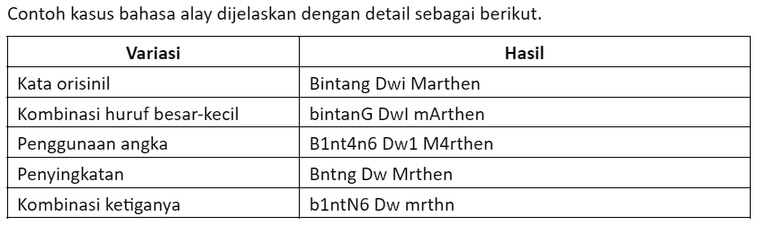
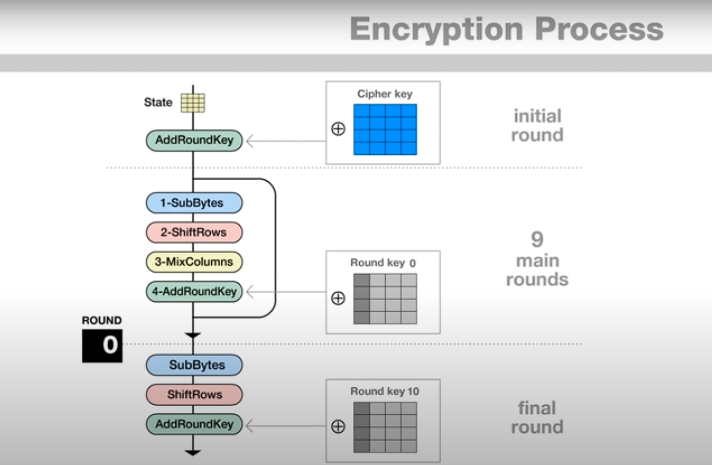

# Tubes3_KacaprukReborn

##### Tangkapan layar dari program :)

>  <br>
>
> 

## Deskripsi Program

> Pada tugas besar kali ini kami membuat program pencocokan sidik jari dengan memanfaatkan algoritma pencocokan string seperti Knuth-Morris-Pratt (KMP) dan Boyer-Moore (BM). Dari input gambar sidik jari yang diinputkan, akan dihasilkan biodata dari pemilik sidik jari tersebut.
>
> Pada mulanya gambar akan ditransformasi menjadi sekumpulan karakter ascii. Kemudian karakter ascii tersebut akan dicocokkan dengan yang ada di database dengan menggunakan algoritma KMP ataupun BM. Setelah itu akan didapatkan nama pemilik dari sidik jari tersebut. Akan tetapi, karena terdapat korup pada tabel biodata, data biodata pemilik sidik jari tersebut memiliki nama alay. Untuk mencocokkan nama asli dengan nama alay tersebut kita dapat menggunakan pencocokan menggunakan regex
>
> Keamanan dari database juga dapat ditambah dengan fitur enkripsi-dekripsi (AES 128). Dengan mengaktifkan fitur ini, data pada biodata selain data dengan tipe enum akan dienkripsi sehingga di database hanya menyisakan ciphertext. Data akan didekripsi apabila diperlukan oleh aplikasi.

## Deskripsi Algoritma

### KMP

> Algoritma KMP adalah salah satu algoritma string matching yang efisien karena dapat melakukan pencarian dengan kompleksitas waktu O(n + m), di mana n adalah panjang teks dan m adalah panjang pola. Algoritma ini bekerja dengan menggunakan informasi yang diperoleh dari pola untuk menghindari pencocokan karakter yang tidak perlu. Secara umum, terdapat dua tahapan saat melakukan pemrosesan dengan algoritma KMP, yaitu preprocessing dan matching
>
> - Preprocessing:<br>
>
>   - Membuat tabel "longest proper prefix which is also suffix" (LPS) untuk pola. Tabel ini membantu menentukan seberapa banyak pergeseran yang diperlukan ketika terjadi ketidakcocokan.
>   - Tabel LPS dibuat dengan menganalisis pattern itu sendiri dan mencatat panjang dari prefiks terpanjang yang juga merupakan sufiks untuk setiap posisi dalam pattern.
>
> - Matching:<br>
>   Mulai pencocokan dari awal teks dan pola.
>   - Jika terjadi kecocokan karakter antara teks dan pola, teruskan ke karakter berikutnya.
>   - Jika terjadi ketidakcocokan, gunakan tabel LPS untuk menentukan pergeseran yang diperlukan tanpa harus membandingkan ulang karakter yang sudah diketahui cocok.

### BM

> Algoritma Boyer-Moore (BM) adalah salah satu algoritma string matching yang efisien dan sering digunakan karena dapat melakukan pencarian dengan kompleksitas waktu rata-rata yang sangat baik. Algoritma ini memanfaatkan informasi yang diperoleh dari pola dan teks untuk menghindari pencocokan karakter yang tidak perlu, sehingga mempercepat proses pencarian. Secara umum, terdapat dua tahapan utama dalam pemrosesan dengan algoritma BM, yaitu preprocessing dan matching.
>
> - Preprocessing:<br>
>   Pada tahap preprocessing, algoritma Boyer-Moore membangun dua tabel penting:<br>
>
>   - Tabel Bad Character (Karakter Buruk): Tabel ini digunakan untuk menentukan seberapa jauh pola dapat digeser ketika terjadi ketidakcocokan karakter. Untuk setiap karakter dalam alfabet, tabel ini mencatat posisi kemunculan terakhir karakter tersebut dalam pola. Jika karakter yang tidak cocok ditemukan dalam teks, pola dapat digeser ke kanan sejauh mungkin sehingga karakter yang tidak cocok tersebut berada di bawah kemunculan terakhirnya dalam pola.
>   - Tabel Good Suffix (Sufiks Baik): Tabel ini digunakan untuk menentukan pergeseran pola ketika terjadi ketidakcocokan pada bagian akhir pola. Tabel ini mencatat informasi tentang seberapa jauh pola dapat digeser ketika sebagian dari pola sudah cocok. Ini membantu dalam menghindari perbandingan ulang karakter yang sudah diketahui cocok.
>
> - Matching:<br>
>   - Mulai Pencocokan dari Akhir Pola: Algoritma Boyer-Moore memulai pencocokan dari akhir pola dan teks, bukan dari awal seperti pada kebanyakan algoritma pencocokan lainnya. Ini memungkinkan penggunaan informasi dari tabel Bad Character dan Good Suffix secara lebih efektif.
>   - Jika Terjadi Kecocokan Karakter: Jika karakter dari pola dan teks cocok, lanjutkan pencocokan ke karakter sebelumnya (bergerak ke kiri dalam pola dan teks).
>   - Jika Terjadi Ketidakcocokan Karakter: Ketika karakter tidak cocok ditemukan, gunakan tabel Bad Character untuk menentukan seberapa jauh pola dapat digeser. Jika tabel Bad Character tidak memberikan pergeseran yang cukup besar, gunakan tabel Good Suffix untuk menentukan pergeseran yang lebih baik.

### REGEX

> Penggunaan regex di sini bertujuan untuk menangani kolom nama yang korup pada tabel biodata. Adapun pendefinisian bahasa alay di sini adalah sebagai berikut<br> > 
> Dari contoh kasus tersebut kita mendapatkan beberapa kategori kata alay yang harus ditangani
>
> - Kombinasi huruf besar-kecil<br>
>   Untuk menangani kasus ini, kita dapat membuat semua semua huruf yang terdapat pada kata alay dibuat menjadi huruf kecil.
> - Penggunaan angka<br>
>   Untuk menangani kasus penggunaan angka di sini saya mendefinisikan apa saja sekiranya angka yang memiliki makna sama dengan suatu huruf. Kami mendaftarkan sekumpulan angka yang memiliki makna sama dengan suatu huruf dengan cara mengetestnya di [bahasa_alay_generator](https://alaygenerator.blogspot.com/). Berikut adalah sekumpulan pasangan angka-huruf yang kami dapatkan <br>

```bash
    pasangan['4'] = 'a';
    pasangan['3'] = 'e';
    pasangan['6'] = 'g';
    pasangan['1'] = 'i';
    pasangan['0'] = 'o';
    pasangan['5'] = 's';
    pasangan['2'] = 'z';
```

> - Penyingkatan<br>
>   Sementara untuk menangani kasus penyingkatan, pengecekan dilakukan dengan mengiterasi seluruh karakter pada kata alay dan membandingkannya dengan karakter pada kata asli. Jika karakter pada indeks tertentu sama, maka pindah ke karakter berikutnya. Jika beda, maka cek apakah karakter pada kata asli itu huruf vokal dan karakter pada kata alay adalah konsonan, maka pindah ke karakter berikutnya di kata asli untuk mengabaikan huruf vokal pada kata asli. Jika setelah diabaikan, konsonan pada karakter asli tidak sama dengan karakter di kata alay, maka kata tersebut tidak memiliki makna yang sama dengan kata alay yang kita inginkan. Pengecekan tersebut terus dilakukan hingga pengecekan di index terakhir kata alay bernilai benar, maka dapat dinyatakan bahwa kata alay tersebut memiliki makna yang sama dengan kata ori yang kita punya.
>   <br>
> - Kombinasi<br>
>   Untuk menangani kasus ini berarti kita akan melakukan konversi untuk seluruh kasus. Justru ini yang akan kita lakukan. Pada saat pengecekan kita akan mengonversi seluruh kata pada kata alay menjadi huruf kecil semua, kemudian mengganti seluruh angka yang terdapat pada kata alay menjadi huruf yang memiliki makna serupa. Setelah itu, kita akan melakukan pengecekan apakah kata alay tersebut memiliki makna sama dengan kata yang kita punya dengan cara mengabaikan huruf vokal yang terdapat pada kata asli.

### AES 128

> Untuk mengamankan data pada tabel biodata, kami juga mengimplementasikan enkripsi-dekripsi dengan algoritma AES 128. AES adalah sebuah algoritma enkripsi simetris yang menggunakan kunci yang sama untuk enkripsi dan dekripsi. Algoritma ini bekerja dengan membagi data menjadi blok-blok yang sama besar dan kemudian melakukan serangkaian operasi enkripsi pada setiap blok.
>
> AES memiliki tiga ukuran kunci yang mungkin: 128-bit, 192-bit, dan 256-bit. Setiap ukuran kunci mengharuskan jumlah putaran yang berbeda dalam proses enkripsi. Pada program ini kami mengimplementasikan AES dengan key berukuran 128-bit.
>
> 
> untuk penjelasan lebih lengkap dapat dilihat pada tautan berikut
> [source](https://www.youtube.com/watch?v=gP4PqVGudtg&t=114s)

## Kebutuhan Program

1. Program ini dikompilasi dengan menggunakan .NET SDK. Proses instalasi .NET SDK dapat dilihat pada [link berikut](https://dotnet.microsoft.com/en-us/download).

2. Selain itu, program ini juga dijalankan dalam server sql, Anda dapat melakukan instalasi mariaDB pada [link berikut](https://mariadb.org/download/?t=mariadb&p=mariadb&r=11.4.2&os=windows&cpu=x86_64&pkg=msi&mirror=bkns)

## Cara Kompilasi

Setelah menginstall .NET SDK dan berhasil menjalankan server sql, kompilasi program dapat dilakukan dengan mengikuti langkah-langkah berikut:

1. Clone repository lalu masuk ke dalam directory nya

   ```bash
   git clone https://github.com/rifchzschki/Tubes3_KacaprukReborn

   cd Tubes3_KacaprukReborn
   ```

2. Lakukan konfigurasi database terlebih dahuhlu

   - Pastikan file database(.sql) yang anda inginkan telah berada di direktori "src/Database/"
   - Masuk ke server sql anda

   ```bash
   mysql -u {username} -p
   ```

   - Buat database baru di server sql anda lalu keluar dari server sql

   ```bash
   create database {database_name};
   quit;
   ```

   - Lakukan restore file sql ke dalam server sql anda

   ```bash
   cd src/Database/
   mysql -u {username} -p {database_name} < {external_file_name}.sql
   ```

   - Database sudah tertanam di server sql Anda!

3. Pastikan pada connection di file DatabaseHelper sudah sesuai dengan konfigurasi akun sql Anda

   ```bash
   private static string connectionString = "Server={server_name};Database={database_name};Uid={username};Pwd={password};";
   ```

4. Jika Anda ingin meningkatkan keamanan data biodata pada database, Anda dapat mengaktifkannya pada file program.cs.

   > HANYA DIJALANKAN SEKALI SAAT PERTAMA KALI DATABASE DI RESTORE, setelah itu uncomment lagi

   ```bash
   Models.Converter.EncryptDatabase();
   ```

5. Program siap dijalankan dengan perintah berikut

   ```bash
   cd "src"
   dotnet run
   ```

6. Program sudah dapat digunakan

## Anggota

| NIM      | NAMA                         |
| -------- | ---------------------------- |
| 13522015 | Yusuf Ardian Sandi           |
| 13522032 | Tazkia Nizami                |
| 13522120 | M Rifki Virziadeili Harisman |
